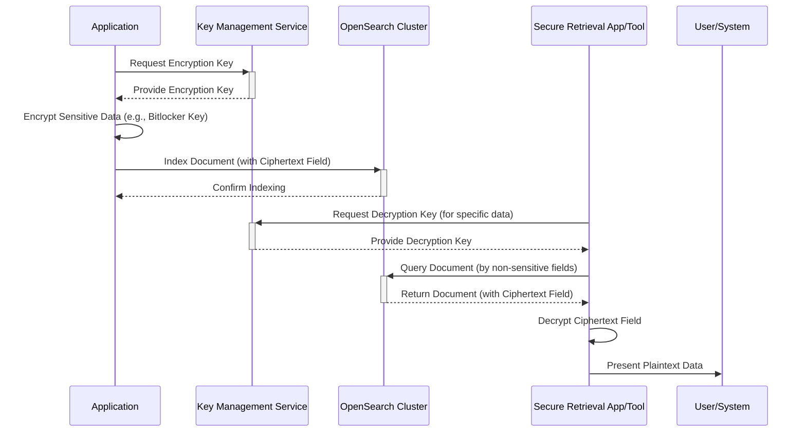
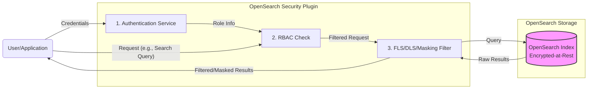

## Introduction

Migrating sensitive data, such as Bitlocker keys or credentials, from systems like SurrealDB (where access might be tightly controlled via custom APIs) to OpenSearch requires careful planning. A primary concern is preventing unauthorized visibility or exposure of this data, especially through powerful tools like OpenSearch Dashboards.

This document outlines the **best, most secure approaches** to achieve robust data protection within the OpenSearch ecosystem, leveraging a defense-in-depth strategy.

**Core Principle:** No single feature is a silver bullet. The highest level of security comes from layering multiple controls effectively.

---

## Approach 1: Highest Security - Application-Level Encryption + Layered Controls

This approach offers the maximum protection for sensitive data *within* OpenSearch, as the platform itself never handles the plaintext values of your most sensitive fields.

**Concept:** Your application encrypts the sensitive data *before* sending it to OpenSearch. OpenSearch stores only the ciphertext. Decryption happens outside OpenSearch in a controlled application environment.

**Data Flow Diagram (Mermaid):**

**Key Components:**

- **Application-Level Encryption:** Use strong algorithms (e.g., AES-GCM) within your indexing application.
- **External Key Management:** Securely manage encryption keys using a dedicated service (AWS KMS, Azure Key Vault, Google Cloud KMS, HashiCorp Vault). Crucially, keys are NOT stored in OpenSearch.
- **Ciphertext Storage:** Store the encrypted value in OpenSearch. Store related non-sensitive metadata in separate fields for searching/filtering.
- **OpenSearch Security Plugin:**
    - **Authentication:** Securely authenticate all clients (applications, users).
    - **RBAC:** Apply strict, least-privilege roles even to the indexing application and retrieval tools.
    - **FLS/DLS:** Use on other potentially sensitive metadata fields if needed.
    - **Audit Logging:** Monitor all access and operations meticulously.
- **Encryption In-Transit (TLS):** Encrypt all network traffic.
- **Encryption At-Rest:** Encrypt data on disk within OpenSearch (protects the ciphertext and other metadata).

**Pros:**

- **Highest Confidentiality:** Plaintext sensitive data never resides in OpenSearch. Protects against compromised OpenSearch nodes or administrators seeing the raw data.
- **Clear Separation of Concerns:** Data protection logic resides in the application layer.

**Cons:**

- **Complexity:** Requires development effort in the application layer for encryption and key management integration.
- **Searchability Limitations:** Cannot perform direct searches (e.g., exact match, range) on the encrypted fields within OpenSearch. Searching relies on non-sensitive metadata.
- **Dedicated Retrieval Process:** Requires a separate, secure application/tool for authorized users to decrypt and view the data.

---

## Approach 2: Strong Security - Granular Access Control (FLS/DLS) + Encryption

This approach leverages OpenSearch's powerful built-in security features to control access within the platform. It's often more practical if application-level encryption is too complex, but requires meticulous configuration.

**Concept:** Data is stored plaintext (or encrypted-at-rest) in OpenSearch, but the Security Plugin strictly controls who can see which fields or documents via sophisticated Role-Based Access Control, Field-Level Security (FLS), and Document-Level Security (DLS).

**Access Control Flow Diagram (Mermaid):**

**Key Components:**

- **OpenSearch Security Plugin (Primary Control):**
    - **Authentication:** Securely authenticate all clients.
    - **RBAC:** Define granular roles (e.g., sensitive_data_admin, standard_user, dashboard_viewer).
    - **Field-Level Security (FLS):** Configure roles to explicitly grant or deny access to specific sensitive fields (e.g., only sensitive_data_admin role can read bitlocker_key field). This is critical for hiding data in Dashboards.
    - **Document-Level Security (DLS):** Filter entire documents based on user roles and document content if needed.
    - **(Optional) Field Masking:** Mask sensitive field values (e.g., show ****) instead of hiding them entirely, if required.
    - **Audit Logging:** Monitor access patterns and policy effectiveness.
- **Encryption In-Transit (TLS):** Encrypt all network traffic.
- **Encryption At-Rest:** Encrypt data on disk within OpenSearch. This protects the data if the underlying storage is accessed directly.

**Pros:**

- **Simpler Application Logic:** No complex encryption/key management needed in the indexing application.
- **Searchability:** Sensitive fields can potentially be searched by users with the appropriate FLS permissions (use with extreme caution!).
- **Integrated Solution:** Security managed primarily within the OpenSearch ecosystem.

**Cons:**

- **Configuration Complexity:** Requires careful and correct configuration of roles, permissions, FLS/DLS rules. Mistakes can lead to exposure.
- **Potential Admin Bypass:** A highly privileged OpenSearch administrator could potentially reconfigure security rules if not properly monitored via auditing.
- **Plaintext Handling:** OpenSearch processes handle plaintext data internally (though protected by Encryption At Rest on disk and FLS/DLS over the API).

---

## Essential Supporting Measures (Apply to BOTH Approaches)

Regardless of the primary approach chosen, these are fundamental:

- **Strong Authentication:** Use robust methods (SAML, OIDC, LDAP, strong internal passwords).
- **Consistent RBAC (Least Privilege):** Grant only the minimum necessary permissions for any user or application.
- **Comprehensive Audit Logging:** Enable, collect, and regularly review audit logs to detect anomalies or unauthorized access attempts.
- **Network Security:** Isolate your cluster (VPCs, security groups/firewalls), restricting access to trusted sources.
- **Patching & Hardening:** Keep OpenSearch, plugins, operating systems, and related applications up-to-date and securely configured.

---

## Conclusion

- For the absolute highest level of data confidentiality, where OpenSearch should never process the plaintext sensitive data, choose **Approach 1: Application-Level Encryption**. Accept the trade-offs in complexity and searchability.
- If application-level encryption is infeasible, but strong protection and controlled visibility (especially hiding fields in Dashboards) are required, choose **Approach 2: Granular Access Control (FLS/DLS)**. This requires meticulous configuration and diligent auditing.

**Always perform thorough security reviews and testing before deploying sensitive data into any system.**